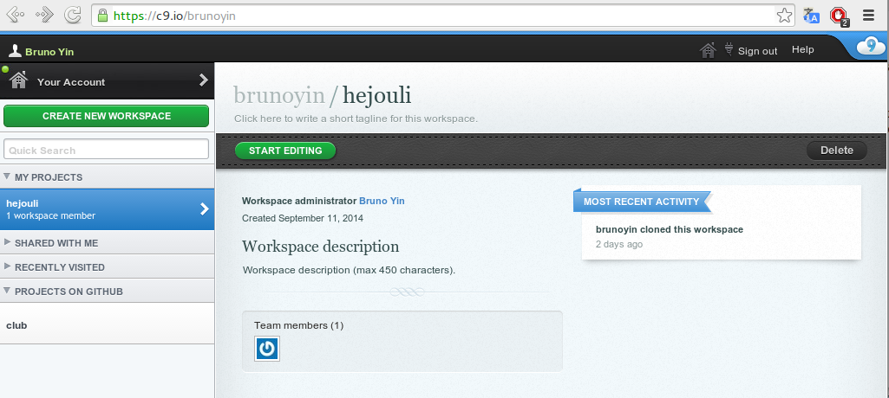

hejouli
=======

###HTML5 and JavaScript

Teaching kids JavaScript and HTML5

###Cloud9 IDE

###Sign up with your github account

1. go to [c9.io](http://c9.io)
2. use your github account to sign up for a free Cloud9 account
3. create new github repo for your project or fork this one
4. Cloud9 editor can clone a github repo, and you can push your updates

###Why Cloud9?

1. it has a nice editor
2. a virtual machine that can host/test your web projects
3. save time on configuring your development machine
4. perfect for learning linux command line tools

