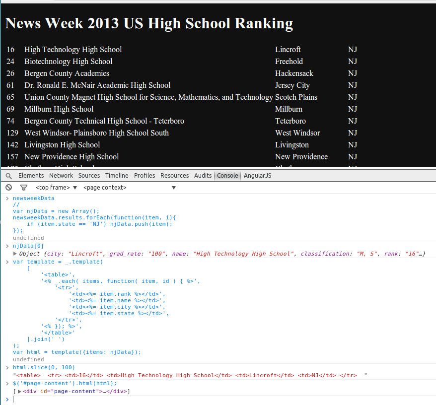

##News Week 2013 high school ranking data display challenge

1. load the provided JSON data [newsweek_highschool_2013](newsweek_highschool_2013.json)
2. display it in a web page in a tabular layout
3. display only one state: filter by state
 
###Learn the basics

1. jQuery Ajax: how to load resources like the JSON data into your web page?
2. examine Javascript objects in the development console
3. jQuery DOM manipulation: insert html string into an html tag
4. templating: an easier alternative to string concatenation. 

###Practice



[index.html](jquery/index.html) is already a basic html page with jQuery and lodash Javascript libs referenced. In Cloud9, run it and open the link in a new browser Window or tab.

Take a look at [app.js](jquery/app.js), it already has the Ajax loading part coded.

Open the browser's development console in the browser window/tab. You can now run javascript code and jQuery and lodash libs are available.

####1  examine the data

in app.js, a global variable called "newsweekData" is declared, later when the browser loads the page, it call jquery Ajax.

```javascript
newsweekData
//
var njData = new Array();
newsweekData.results.forEach(function(item, i){
    if (item.state == 'NJ') njData.push(item);
});
```

####2  play with templates

 ```javascript
// we want to create an html table
// template is made of text with embedded javascript
// one way to concatenate strings is to put them in an array, then join the array
// you can use + operator to do the same thing. But an array makes more readable.
var template = _.template(
    [
        '<table>',
        '<% _.each( items, function( item, id ) { %>',
            '<tr>',
                '<td><%= item.rank %></td>',
                '<td><%= item.name %></td>',
                '<td><%= item.city %></td>',
                '<td><%= item.state %></td>',
            '</tr>',
        '<% }); %>',
        '</table>'
    ].join(' ')
);
var html = template({items: njData});
```


####3  manipulate page content with jQuery

```javascript
// select the tag where we want to insert the html string
/**
    <div id="page-content">
           tabular data goes here     
     </div>
*/
$('#page-content').html(html);
```

####4  work on the challenge

Now you need to put this code to work when the browser loads the web page. 
Check out the complete Flickr jQuery example if you are not sure what to dow.
 
